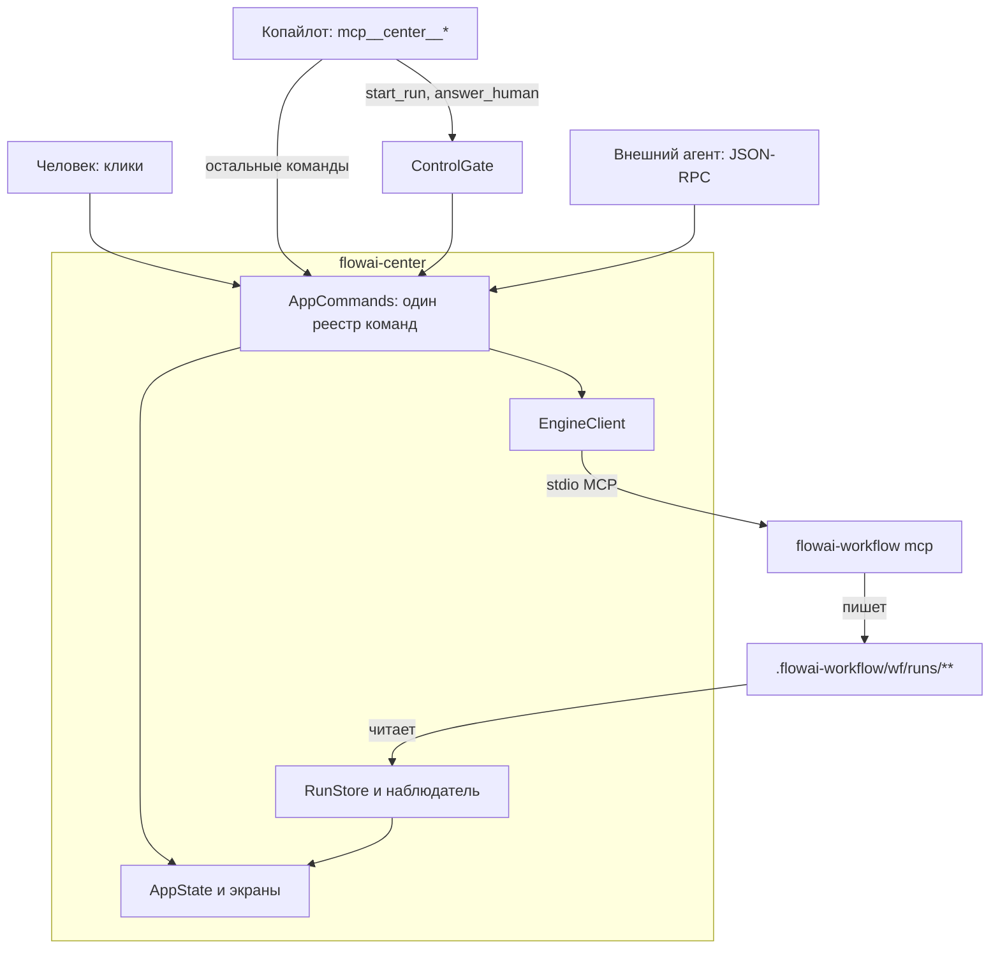

# Нативное приложение для наблюдения и управления flowai-workflow

## Goal

Дать инженеру одно нативное окно на запуски flowai-workflow: видеть, что
делает каждый узел DAG, сколько это стоит, где запуск встал, — и вмешаться
не выходя из окна (стартовать, продолжить, отменить, ответить на вопрос
человеку). Сегодня то же самое собирается вручную из `sdlc-status.ts`,
статического HTML-дашборда и чтения артефактов в терминале.

## Overview

### Context

Пользователь просит нативное приложение и указывает на `flowai-hive` (Royak)
как на ориентир. Решения пользователя, зафиксированные в диалоге:

- Приложение живёт в **новом отдельном репозитории** — не в `flowai-hive` и
  не в `flowai-workflow`.
- Приложение видит **один активный проект за раз**, переключение в настройках.

`flowai-hive` — нативное macOS-приложение (Swift 6 / SwiftUI / SPM, без
`.xcodeproj`, macOS 14+, без внешних зависимостей). Оно построено на двух
принципах, которые и делают его ценным ориентиром:

1. **Сборка через автоматизацию.** Каждый экран обязан быть управляем и
   читаем агентом без человека за клавиатурой: JSON-RPC endpoint
   `--automation`, headless-режимы `--dump` / `--snapshot` / `--dump-ax`,
   дерево доступности. Изменение проверяется против реально работающего
   приложения, а не чтением кода.
2. **Copilot — руки оператора.** Встроенный агент работает на пользовательском
   `claude` CLI, видит приложение только через собственные MCP-инструменты
   приложения и действует только теми же путями `AppState`, что и клик. Любая
   запись висит на подтверждении в чате, и гейт реализован в сервере
   инструментов, а не в промпте.

Домен роя в `flowai-hive` сознательно не спроектирован: там есть оболочка и
один экран сессий, читающий логи Claude Code. Гейт подтверждения написан и
покрыт тестом, но ни один инструмент его пока не вызывает — он ждёт именно
write-инструментов роя.

Исторический контекст движка: в документах трижды упомянут `flowai-center` как
будущий встраивающий хост, и под него сделаны две возможности — `FR-E68`
(колбэк жизненного цикла узла, issue #217) и `FR-E69` (долговечный журнал
запуска, issue #218). Репозитория с таким именем на диске нет. `FR-E68`
рассчитан на Deno-хост в одном процессе и нативному приложению недоступен;
`FR-E69` рассчитан именно на чтение из чужого процесса и подходит полностью.

В `documents/ideas.md` та же поверхность уже описана пунктами #1 (визуальный
редактор DAG), #3 (встроенный MCP-сервер — реализован как `FR-E73`), #13
(панель запуска и статуса в IDE поверх MCP) и #14 (`currentNodeId` как
телеметрия через SSE или websocket).

### Current State

**Что движок отдаёт для наблюдения — только чтение файлов, без единого
изменения в движке:**

- `<workflowDir>/runs/.lock` — `{pid, hostname, run_id, started_at}`, пока
  запуск владеет папкой workflow. Живость проверяется `lock.liveLockHolder`
  (`src/state/lock.ts`).
- `runs/<id>/journal.jsonl` — append-only журнал, реплей которого
  восстанавливает `RunState` (`src/state/run-journal.ts`,
  `replayRunJournal`). Это официальный контракт восстановления (`FR-E69`).
- `runs/<id>/state.json` — состояние запуска, записанное движком.
- **Два источника, и ни один не универсален.** Журнал появился с `FR-E69`,
  поэтому запуски старше него его не имеют, а новые запуски могут не иметь
  `state.json`. В этом репозитории лежат оба случая:
  `.flowai-workflow/github-inbox/runs/20260501T020329/` — только `state.json`,
  `.flowai-workflow/github-inbox/runs/20260524T015927/` — только
  `journal.jsonl`. При этом `replayRunJournal` вызывает `parseJournal` с
  `allowMissing: false` (`src/state/run-journal.ts:100`) и на отсутствующем
  журнале бросает `NotFound`. Читатель обязан поддерживать оба источника.
- **Каталоги узлов и логи лежат не там, где подсказывает интуиция.** Пути
  узлов относительны рабочего каталога агента, а он равен worktree запуска
  (FR-E52), поэтому один и тот же относительный путь разрешается в двух
  корнях. Проверено на реальном запуске `20260524T015927`:
  - каталог узла объявлен в журнале событием `node_directory_declared` с
    полем `node_dir`, и это не `runs/<id>/<node-id>/`, а путь с фазой —
    например `.flowai-workflow/github-inbox/runs/<id>/plan/design`. Угадывать
    раскладку нельзя, её сообщает журнал;
  - тот же относительный путь от корня репозитория даёт долговечную копию с
    объявленными артефактами (`02-plan.md`), а от worktree — рабочую копию,
    где вдобавок лежат `stream.log` и `system-prompt.md`;
  - `logs/<nodeId>.json` (сводка `CliRunOutput`) и `logs/<nodeId>.jsonl`
    (полный поток, сотни килобайт) существуют ТОЛЬКО внутри worktree.
  Следствие: когда worktree удалён или подчищен, поток и системный промпт
  узла недоступны, и это надо говорить прямо, а не показывать пустоту.
- `NodeState.question_json` — вопрос ожидающего HITL-узла, пишется
  `markNodeWaiting` (`src/state/state.ts:341`) и потому durable-читаем.
- Готовые образцы того же чтения: `scripts/sdlc-status.ts` (строго по
  долговечным артефактам, без пайпа в движок) и
  `scripts/generate-dashboard.ts` (реплей журнала → самодостаточный HTML с
  карточками узлов, диаграммой Ганта и графиком стоимости).

**Что движок отдаёт для управления — девять MCP-инструментов по stdio,
`flowai-workflow mcp <workflow>` (`FR-E73`, `src/mcp/mcp-server.ts`):**

- `start_run({prompt?, wait?})` — при `wait:false` запускает движок отдельным
  отсоединённым процессом и сразу возвращает `{run_id, pid}` (`FR-E84`).
- `resume_node({run_id, wait?})` — при `wait:false` то же для продолжения;
  отказывает, если запуск живой (`FR-E85`).
- `cancel_run({run_id})` — читает замок и шлёт SIGTERM владельцу.
- `provide_human_input({run_id, node_id, text})` — кладёт ответ человека в
  файл-ящик `getHitlInboxPath` (`src/state/state.ts:214`).
- `get_workflow`, `get_state`, `list_runs`, `tail_artifacts`,
  `apply_workflow_patch`.

Общее ядро команд — `src/mcp/commands.ts` (`startRun`, `resumeRun`,
`resumeRunBackground`, `deliverHumanAnswer`), единая точка сборки движка для
CLI и MCP.

**Вывод по движку:** доработок не требуется. Наблюдение закрывается чтением
долговечных артефактов, управление — существующей поверхностью MCP, вопрос
человеку durable-читаем, ответ durable-записываем.

### Constraints

- Приложение нативное. Ориентир — `flowai-hive`, значит целевая платформа
  macOS 14+, Swift 6 / SwiftUI / SPM без `.xcodeproj` и без внешних
  зависимостей. Если платформа предполагалась другая, это надо назвать до
  начала работ — предположение зафиксировано здесь явно.
- Новый отдельный репозиторий `flowai-center`. Имя свободно: на диске в
  `/Users/korchasa/www/flowai/` такого каталога нет, на GitHub
  `korchasa/flowai-center` не существует (`gh repo view` отвечает
  `Could not resolve to a Repository`). Ни `flowai-hive`, ни `flowai-workflow`
  не меняются этой задачей.
- Один активный проект за раз, переключение в настройках.
- Движок не меняем. Если по ходу работ обнаружится реальный пробел, он
  оформляется отдельным FR в `flowai-workflow`, а не обходным путём в
  приложении.
- Управление идёт через задокументированную поверхность MCP, а не через
  разбор вывода CLI. Причина фактическая: `FR-E84` создан ровно затем, чтобы
  снять с вызывающей стороны запуск `flowai-workflow run` в фоне с
  выскабливанием `run_id` из лога.
- Читаем движок только по долговечным артефактам. Внутренние TypeScript-типы
  не импортируются — воспроизводится форма JSON, зафиксированная журналом.
- Приложение не пишет ничего внутрь `runs/<run-id>/` мимо MCP: артефакты
  запуска принадлежат движку.

### Affected Surface

Независимая разведка поверхности (`surface-scout`), дословно:

```
## Surface

- **`src/mcp/mcp-server.ts` (embedded MCP server, all ~9 tools)** — this is the engine's primary control/observation API and the most direct integration point for a native observer/manager app (mirrors what `flowai-hive`'s Royak does via its own local MCP + AutomationServer). Evidence: `src/mcp/mcp-server.ts:1-140` (tool list: `get_workflow`, `get_state`, `list_runs`, `tail_artifacts`, `start_run`, `resume_node`, `cancel_run`, `apply_workflow_patch`, `provide_human_input`).
- **`src/mcp/commands.ts`** — unified command layer (`startRun`, `resumeRun`, `resumeRunBackground`, `deliverHumanAnswer`) that both MCP and CLI call; any native app driving runs must go through this contract. Evidence: `src/mcp/commands.ts:1-80`.
- **`src/cli.ts` `mcp` subcommand and `answer` subcommand** — CLI-side entry points a native app might shell out to, or that document the same operations MCP exposes. Evidence: `src/cli.ts:583-710` (subcommand dispatch, `INTERNAL_HITL_MCP_ARG`, `mcp` case).
- **`src/state/state.ts`** — `RunState`/`NodeState` shape, `getRunDir`, `getNodeDir`, `getLogsDir`, `getHitlInboxPath` — the on-disk schema a native app would read directly if not going through MCP. Evidence: `src/state/state.ts` (exports list, e.g. `createRunState`, `markNode*`, `getResumableNodes`).
- **`src/state/run-journal.ts`** — `replayRunJournal`, `getJournalPath`, `loadStateFromJournal`, `RunJournalWriter` — the durable append-only journal format (`journal.jsonl`) that is the authoritative recovery source for any host reconstructing run state after restart. Evidence: `src/state/run-journal.ts` exports; `documents/tasks/2026/05/durable-run-lifecycle-replay.md`.
- **`src/state/lock.ts`** — `readLockInfo`, `isRunLive`, `liveLockHolder`, `defaultLockPath` — liveness detection a native app needs before deciding "attach" vs "resume-after-fail" vs "cancel". Evidence: `src/state/lock.ts` exports.
- **`src/engine/engine.ts` `EngineOptions.onNodeLifecycle`** (FR-E68) — the in-process live callback explicitly designed for an embedding host (named example: `flowai-center`) to get live node updates without polling; if the "native app" embeds the engine (Deno host) rather than driving it purely over MCP, this is the primary hook. Evidence: `documents/requirements-engine/05-cli-and-observability.md:317-360`, `documents/tasks/2026/05/node-lifecycle-callback.md`.
- **`src/process-registry.ts`** — `installSignalHandlers`, `ProcessRegistry` scoping — embedding-host contract (signal ownership, subprocess kill scoping) documented in README "Embedding vs standalone use" that any native-app host process must honor. Evidence: `README.md:535-585`, `src/process-registry.ts` exports.
- **`src/hitl/` (`hitl-mcp-server.ts`, `hitl-handler.ts`, `hitl-injection.ts`)** — the human-in-the-loop channel (local inbox files, `request_human_input` tool) a native app's UI would need to surface and answer through. Evidence: `src/hitl/hitl-mcp-server.ts:27-88`, `src/hitl/hitl-handler.ts:80-107`.
- **`scripts/generate-dashboard.ts` + `scripts/generate-dashboard_test.ts`** — the existing (HTML, static) observability surface for run state; a native app duplicates/supersedes this rendering logic (Gantt timeline, phase status, stream-log viewer) — parallel implementation to watch for conceptual drift. Evidence: `documents/requirements-sdlc/05-dashboard-and-observability.md` (FR-S16/19/20/34), `documents/design-sdlc/02-dashboard-and-validation.md`.
- **`documents/ideas.md` items #1, #3, #13, #14** — pre-existing backlog entries proposing exactly this kind of surface (visual editor/VS Code extension over embedded MCP, MCP facade, VS Code "Run workflow" panel, live `currentNodeId` telemetry channel). A new native-app initiative should reconcile with/supersede these. Evidence: `documents/ideas.md:14-16, 27-36, 108-123, 125-131`.
- **`documents/requirements-engine/06-distribution-and-housekeeping.md`** and **`documents/tasks/2026/05/phase-registry-per-run.md`** — mention `flowai-center` as the anticipated sequential-engine-embedding host; strongly suggests this native app is (or should align with) that already-named future host. Evidence: `documents/requirements-engine/06-distribution-and-housekeeping.md:159`, `documents/tasks/2026/05/phase-registry-per-run.md:34`.
- **Distribution/plugin payload (`plugin-src/`, `.mcp.json` in Claude/Codex payloads, `scripts/sync-plugins-repo.ts`, `scripts/build-plugin-payload.ts`)** — if the native app is meant to be installable alongside or instead of the Claude/Codex plugin MCP wiring, the existing MCP-launch contract (`flowai-workflow mcp`, `FLOWAI_WORKFLOW` resolution) is a parallel consumer/producer to keep in sync. Evidence: `documents/index.md`/AGENTS.md "Plugin payload cross-repo sync" section (`plugin-src/shared/`, `plugin-src/claude/.mcp.json`).
- **`README.md`** — "Development Commands" (`deno task dashboard`), "Embedding vs standalone use" section, and any new "native app" quick-start would need a new subsection. Evidence: `README.md:521, 535-585`.
- **`documents/requirements-sdlc.md` / `requirements-engine.md` index files** — a new FR (likely `FR-E<N>` for the engine-facing API surface, or `FR-S<N>`/new doc entirely if this is a separate product) would need an index entry per the project's Documentation Hierarchy rule.
- **Reference project `/Users/korchasa/www/flowai/flowai-hive`** (Royak) — explicitly named as the architectural reference: its `AutomationServer.swift`/`LocalMCPListener.swift` (localhost JSON-RPC control endpoint), `CopilotToolServer.swift` (MCP tool server exposing app state to an embedded Claude Copilot), `SessionScanner.swift` (reads Claude/Codex session logs from `~/.claude`/`~/.codex`) are parallel implementations a "flowai-workflow native app" would likely mirror one-for-one (own MCP server, own automation JSON-RPC mode, own `--dump`/`--snapshot`/`--dump-ax` headless test modes). This is a **separate Swift repo**, not part of `flowai-workflow` — noted as a sibling surface, not a file to edit here.

## Could not rule out

- Whether "native app" means (a) a new companion macOS/Swift repo like `flowai-hive`, (b) a Deno-embedded host akin to the described `flowai-center`, or (c) an extension of `flowai-hive` itself to also drive `flowai-workflow` runs (not just Claude/Codex sessions) — the request text doesn't disambiguate, and this materially changes whether any code inside `flowai-workflow` needs new tools/fields versus only documentation/FR additions.
- Whether `flowai-center` already exists as a real (possibly private) repo the user intends to reuse/rename, or is purely a placeholder name from prior planning docs.
- Whether GitHub issues #217/#218 (referenced in task docs as filed by/about `flowai-center`) contain scope details not visible in this repo's docs.
```

Диспозиции по объединению моего списка и списка разведчика:

- `src/mcp/mcp-server.ts` (девять инструментов) — covered-by: канал управления
  приложения, DoD «управление запуском» и «ответ человеку».
- `src/mcp/commands.ts` — not affected: приложение вызывает инструменты MCP, а
  не команды напрямую; общее ядро остаётся внутренним делом движка
  (`src/mcp/mcp-server.ts` вызывает `commands.*` сам).
- `src/cli.ts` подкоманды `mcp` и `answer` — covered-by: приложение порождает
  `flowai-workflow mcp <workflow>` как дочерний процесс; подкоманда `answer`
  не используется, потому что тот же эффект даёт `provide_human_input`.
- `src/state/state.ts` (`RunState`, `NodeState`, пути) — covered-by: DoD
  «чтение запусков», форма JSON воспроизводится в модели приложения.
- `src/state/run-journal.ts` (`replayRunJournal`, `journal.jsonl`) —
  covered-by: DoD «чтение запусков» и «живое обновление».
- `src/state/lock.ts` (`runs/.lock`, живость) — covered-by: DoD «различение
  живого и мёртвого запуска».
- `src/engine/engine.ts` `EngineOptions.onNodeLifecycle` (`FR-E68`) — not
  affected: колбэк работает только для Deno-хоста в одном процессе
  (`documents/requirements-engine/05-cli-and-observability.md:317-360`), а
  приложение нативное и внешнее; его роль закрывает `FR-E69`.
- `src/process-registry.ts`, `installSignalHandlers` — not affected: контракт
  касается хоста, встраивающего `Engine` в свой процесс
  (`README.md:535-585`); приложение движок не встраивает.
- `src/hitl/*` — covered-by: DoD «ответ человеку»; наружу торчат
  `NodeState.question_json` и файл-ящик, оба уже durable.
- `scripts/generate-dashboard.ts` — not affected как код, но это параллельная
  реализация того же смысла: приложение повторяет её логику отображения на
  Swift. Расхождение фиксируется в Follow-ups, дашборд не удаляется.
- `scripts/sdlc-status.ts` — not affected: остаётся терминальным инструментом
  супервизора; приложение читает те же файлы независимо.
- `documents/ideas.md` #1, #3, #13, #14 — deferred — human choice: решение,
  поглощает ли новая инициатива эти пункты, за пользователем.
- `plugin-src/**`, `scripts/sync-plugins-*.ts` — not affected: приложение не
  плагин IDE и не участвует в payload-синхронизации; контракт запуска MCP
  (`flowai-workflow mcp`) переиспользуется как есть, без изменений.
- `README.md`, `documents/index.md` — not affected: движок не меняется, новых
  FR в нём не появляется; документация нового приложения живёт в новом
  репозитории.
- Упоминания `flowai-center` в
  `documents/requirements-engine/05-cli-and-observability.md:321`,
  `documents/requirements-engine/06-distribution-and-housekeeping.md:159` и
  задачах `node-lifecycle-callback.md`, `durable-run-lifecycle-replay.md`,
  `phase-registry-per-run.md` — deferred — human choice. Имя занято этой
  задачей под внешнее нативное приложение, а в этих строках им назван
  Deno-хост, встраивающий `Engine` в свой процесс. Строки становятся
  неточными; правка — отдельная задача (см. Follow-ups).
- `flowai-hive`, `AutomationServer` и `AXTree` — covered-by: шаг 9 решения.
  Механизмы переносятся переписыванием под новый домен, файлы не копируются;
  `flowai-hive` не редактируется.
- `flowai-hive`, `LocalMCPListener` и `CopilotToolServer` — covered-by: шаг 8
  решения. Механизмы переносятся переписыванием поверх реестра команд.
- `flowai-hive`, `HangWatchdog` — not affected: диагностика зависаний
  измеренного кода, а измерять в ненаписанном приложении нечего.

## Definition of Done

Все FR-коды относятся к SRS нового репозитория `flowai-center`
(`docs/srs.md`), а не к `flowai-workflow`. Пути тестов и команды —
относительно корня `flowai-center`.

- [x] Репозиторий `flowai-center` создан и собирается: цели `CenterKit`,
      `Center`, `CenterKitTests`, Swift 6 / SwiftUI / SPM, macOS 14+, без
      `.xcodeproj`.
  - FR: FR-REPO.BOOTSTRAP
  - Test: manual — korchasa
  - Evidence: `swift build && swift test --no-parallel`
- [x] Документы репозитория заведены: `AGENTS.md`, `docs/srs.md` с секцией на
      каждый FR ниже и заполненным полем `**Acceptance:**`, `docs/design.md`,
      `docs/index.md`, `README.md`.
  - FR: FR-REPO.BOOTSTRAP
  - Test: manual — korchasa
  - Evidence: `grep -c '^### FR-' docs/srs.md` — совпадает с числом FR ниже
- [x] Один активный проект за раз: каталог принимается, только если содержит
      `.flowai-workflow/<name>/workflow.yaml`; выбор хранится между запусками;
      переключение в настройках (⌘,); `--project` задаёт эфемерный выбор и
      ничего не пишет в `UserDefaults`.
  - FR: FR-PROJECT.ACTIVE
  - Test: `Tests/CenterKitTests/ProjectRootsTests.swift`
  - Evidence: `swift test --filter ProjectRootsTests`
- [x] Реплей `journal.jsonl` восстанавливает состояние запуска: узлы, их
      статусы, попытки, итерации циклов, стоимость, терминальный статус
      запуска. Битая или оборванная последняя строка не роняет разбор.
  - FR: FR-RUNS.SCAN
  - Test: `Tests/CenterKitTests/RunJournalReaderTests.swift`
  - Evidence: `swift test --filter RunJournalReaderTests`
- [x] Запуск без журнала читается из `state.json`, запуск без `state.json` —
      из журнала, запуск без обоих файлов помечается нечитаемым и не роняет
      обход каталога.
  - FR: FR-RUNS.SCAN
  - Test: `Tests/CenterKitTests/RunStoreSourceTests.swift`
  - Evidence: `swift test --filter RunStoreSourceTests`
- [ ] Экран запусков: список запусков активного workflow и детализация
      выбранного — узлы в порядке DAG со статусом, длительностью и
      стоимостью; раскрытие узла показывает вывод рантайма и артефакты.
  - FR: FR-RUNS.UI
  - Test: `Tests/CenterKitTests/RunsUXBehaviorTests.swift`
  - Evidence: `swift run Center --snapshot out.png --project test-project --view-runs`;
    визуальная приёмка — korchasa
  - Факт: экран сделан (`RunListView`, `RunDetailView`), поведение закрыто
    `RunPresentationTests` и `AppStateTests`, содержимое окна проверяется
    через `--dump-screen`. Снимка в PNG нет, визуальной приёмки не было.
- [x] Картина обновляется по мере дописывания журнала: наблюдатель дочитывает
      файл с запомненного смещения, не перечитывая его целиком.
  - FR: FR-RUNS.LIVE
  - Test: `Tests/CenterKitTests/RunWatcherTests.swift`
  - Evidence: `swift test --filter RunWatcherTests`
- [x] Живой запуск отличается от мёртвого по `runs/.lock`: владелец жив —
      «выполняется», владельца нет — «оборван».
  - FR: FR-RUNS.LIVENESS
  - Test: `Tests/CenterKitTests/LockReaderTests.swift`
  - Evidence: `swift test --filter LockReaderTests`
- [x] Каталог узла берётся из журнала, а не выводится из идентификатора узла;
      файлы узла показываются объединением долговечной копии и копии в
      worktree с пометкой источника; удалённый worktree оставляет долговечную
      копию читаемой, а вывод узла помечает недоступным.
  - FR: FR-RUNS.UI
  - Test: `Tests/CenterKitTests/RunPathsTests.swift`
  - Evidence: `swift test --filter RunPathsTests`
- [x] Узел в статусе `running` или `waiting` внутри завершённого запуска
      помечается застрявшим, а не показывается работающим.
  - FR: FR-RUNS.LIVENESS
  - Test: `Tests/CenterKitTests/LockReaderTests.swift`
  - Evidence: `swift test --filter LockReaderTests`
- [x] Управление движком идёт через дочерний процесс `flowai-workflow mcp
      <workflow>` по stdio: `start_run` и `resume_node` с `wait:false`,
      `cancel_run`, `get_workflow`, `list_runs`, `tail_artifacts`.
  - FR: FR-CONTROL.MCP
  - Test: `Tests/CenterKitTests/EngineControlTests.swift`
  - Evidence: `swift test --filter EngineControlTests`
- [x] Дочерний процесс движка запускается с рабочим каталогом, равным корню
      активного проекта, и с абсолютным путём к каталогу workflow. Запуск из
      собранного `Center.app` (рабочий каталог `/`) не ломает git-операции
      движка.
  - FR: FR-CONTROL.MCP
  - Test: `Tests/CenterKitTests/EngineControlTests.swift`
  - Evidence: `swift test --filter EngineControlTests`
- [x] Дочерний процесс привязан к паре «проект и workflow»: смена workflow
      останавливает старый процесс и поднимает новый, действия не уходят в
      предыдущий workflow.
  - FR: FR-CONTROL.MCP
  - Test: `Tests/CenterKitTests/EngineControlTests.swift`
  - Evidence: `swift test --filter EngineControlTests`
- [x] Ошибка инструмента движка (`isError`) отличается от обрыва канала: первая
      возвращается вызывающему с текстом движка, вторая проваливает все
      незавершённые вызовы, переводит движок в «недоступен» и не перезапускает
      его сама.
  - FR: FR-CONTROL.MCP
  - Test: `Tests/CenterKitTests/EngineControlTests.swift`
  - Evidence: `swift test --filter EngineControlTests`
- [x] При недоступном движке экраны наблюдения продолжают работать, а команды
      управления проваливаются с названной причиной.
  - FR: FR-CONTROL.MCP
  - Test: `Tests/CenterKitTests/EngineControlTests.swift`
  - Evidence: `swift test --filter EngineControlTests`
- [x] Ожидающий узел показывает вопрос из `question_json`, а ответ уходит
      через `provide_human_input`.
  - FR: FR-CONTROL.HITL
  - Test: `Tests/CenterKitTests/HumanInputTests.swift`
  - Evidence: `swift test --filter HumanInputTests`
- [x] Способность приложения описана один раз: клик, копайлот и внешний агент
      вызывают одну реализацию из реестра команд, и команда без спецификации
      параметров не собирается.
  - FR: FR-COMMANDS.REGISTRY
  - Test: `Tests/CenterKitTests/AppCommandsTests.swift`
  - Evidence: `swift test --filter AppCommandsTests`
- [x] `start_run` и `answer_human`, вызванные копайлотом, ждут согласия
      оператора; отказ и таймаут отменяют действие. `cancel_run`,
      `resume_run`, клик человека и вызовы автоматизации проходят без вопроса.
  - FR: FR-CONTROL.CONFIRM
  - Test: `Tests/CenterKitTests/ControlGateTests.swift`
  - Evidence: `swift test --filter ControlGateTests`
- [x] Требование подтверждения объявлено в реестре рядом со спецификацией
      команды, а не в сервере инструментов: перечень гейтируемых команд читается
      из одного места и совпадает с тем, что срабатывает на транспорте.
  - FR: FR-CONTROL.CONFIRM
  - Test: `Tests/CenterKitTests/ControlGateTests.swift`
  - Evidence: `swift test --filter ControlGateTests`
- [x] Ответ на подтверждение недостижим с транспорта копайлота: `confirm` и
      `engine_tool` отсутствуют в списке инструментов копайлота, а их вызов
      оттуда отклоняется.
  - FR: FR-COPILOT.GATE
  - Test: `Tests/CenterKitTests/CopilotToolServerTests.swift`
  - Evidence: `swift test --filter CopilotToolServerTests`
- [x] Копайлот работает на пользовательском `claude` CLI: запрещены все
      встроенные инструменты, разрешены только `mcp__center__*`; путь к CLI —
      настройка; протухший `--resume` начинает новый разговор.
  - FR: FR-COPILOT.CHAT
  - Test: `Tests/CenterKitTests/CopilotRuntimeTests.swift`
  - Evidence: `swift test --filter CopilotRuntimeTests`
- [ ] Каждый вызов инструмента копайлотом попадает в ленту действий, а шаг в
      полёте виден в `ui_state`; команда без фразы не собирается.
  - FR: FR-COPILOT.TOOLS
  - Test: `Tests/CenterKitTests/PhrasebookTests.swift`
  - Evidence: `swift test --filter PhrasebookTests`
  - Факт: отдельной «фразовой книги» нет. Вызовы инструментов видны в панели
    разговора, журнал команд отдаёт `GET /journal`, шаг в полёте виден в
    `/screen`. Команда без спецификации в реестре не собирается —
    `AppCommandsTests`.
- [x] Приложение управляемо снаружи: JSON-RPC на 127.0.0.1 с токеном,
      поднимается только при `--automation`; методы наблюдения, вида,
      управления, гейта, копайлота и сверки с движком доступны.
  - FR: FR-AUTOMATION.ENDPOINT
  - Test: `Tests/CenterKitTests/AutomationServerTests.swift`
  - Evidence: `swift test --filter AutomationServerTests`
- [x] Ответ `ui_state` держит зафиксированную форму: проект, workflow,
      состояние движка, экран, выбор, поиск, список запусков с живостью и
      источником чтения, состояние копайлота; поля `activity` и
      `pending_confirmation` отсутствуют, когда нечему быть в полёте и нечего
      подтверждать.
  - FR: FR-AUTOMATION.ENDPOINT
  - Test: `Tests/CenterKitTests/UIStateTests.swift`
  - Evidence: `swift test --filter UIStateTests`
- [x] Строгая проверка параметров на обоих входных транспортах: вызов с
      неизвестным ключом отклоняется с перечислением принимаемых, с
      пропущенным обязательным — по имени, и ничего не меняет.
  - FR: FR-AUTOMATION.STRICT
  - Test: `Tests/CenterKitTests/CommandSpecTests.swift`
  - Evidence: `swift test --filter CommandSpecTests`
- [ ] Headless-режимы работают: `--dump` печатает запуски, `--snapshot`
      рендерит окно в PNG, `--dump-ax` печатает дерево доступности.
  - FR: FR-AUTOMATION.HEADLESS
  - Test: `Tests/CenterKitTests/AXTreeTests.swift`
  - Evidence: `.build/debug/Center --dump --project test-project`,
    `.build/debug/Center --dump-ax`
  - Факт: `--dump`, `--snapshot` (JSON), `--dump-screen` и `--engine-check`
    работают. Рендера окна в PNG и дерева доступности из AppKit нет —
    описание окна строится из состояния приложения.
- [x] Фикстуры синтетические и детерминированные:
      `scripts/make-test-project.sh` создаёт
      `test-project/.flowai-workflow/demo/runs/**`, включая запуск только с
      журналом, запуск только с `state.json` и запуск с ожидающим
      HITL-узлом; реальный проект пользователя не копируется.
  - FR: FR-REPO.BOOTSTRAP
  - Test: manual — korchasa
  - Evidence: `sh scripts/make-test-project.sh && swift test --no-parallel`

## Solution

Вариант B: новый репозиторий с нуля, механизмы переносятся переписыванием под
новый домен, файлы из `flowai-hive` не копируются.

### 1. Каркас репозитория

Создать `/Users/korchasa/www/flowai/flowai-center`. `Package.swift`
(`swift-tools-version:6.0`, `platforms: [.macOS(.v14)]`), три цели:

- `CenterKit` — библиотека без UI: домен, чтение артефактов, клиент MCP,
  runtime copilot.
- `Center` — исполняемая цель SwiftUI: `AppState`, экраны, сервер инструментов
  copilot, сервер автоматизации, headless-режимы, дерево доступности,
  watchdog.
- `CenterKitTests` — swift-testing (`@Test` / `#expect`).

`Makefile` со стандартным интерфейсом `check` / `test` / `dev` / `prod` /
`restart`. Локальные запуски всегда поднимают endpoint автоматизации
(`CENTER_AUTOMATION_PORT`, `CENTER_AUTOMATION_TOKEN`), иначе принцип «сборка
через автоматизацию» не выполняется. `scripts/make-app.sh` собирает
`dist/Center.app`, `scripts/make-test-project.sh` пишет синтетические
фикстуры.

Тесты запускать `swift test --no-parallel`: тела тестов ждут дочерние
процессы, и параллельный прогон исчерпывает кооперативный пул.

### 2. Домен проекта (`CenterKit/ProjectRoots.swift`)

`FlowaiProject` — путь проекта плюс перечень workflow. `ProjectDetection.detect(path:)`
возвращает `nil` для каталога без `.flowai-workflow/<name>/workflow.yaml`;
`AppState.setProject` отказывает с видимой ошибкой, а не регистрирует пустой
источник. Активный проект один, хранится в `center.project.v1`; `--project`
эфемерен и в `UserDefaults` не пишет.

### 3. Чтение запусков (`CenterKit/RunJournalReader.swift`)

Зеркало `replayRunJournal` на Swift. Читать `journal.jsonl` побайтово, разделяя
по `0x0A` и не материализуя `String` на строку — урок `flowai-hive`, где
разбиение строки по символу `"\n"` стоило сегментации графемных кластеров по
каждому байту.

Разбор: каждая строка — конверт `{schema_version, run_id, seq, event_id, kind,
ts, …}`. События применяются по возрастанию `seq` к пустой модели. Неизвестный
`kind` пропускается, а не роняет разбор: движок вправе добавлять виды событий.
Оборванная последняя строка отбрасывается — писатель движка усекает файл до
последней валидной записи при открытии, так что незавершённый хвост штатен.

`RunState` и `NodeState` воспроизводятся как Swift-структуры по форме JSON.
TypeScript-типы движка не импортируются; форму фиксируют фикстуры.

**Два источника.** Журнал появился с `FR-E69`, поэтому он есть не у каждого
запуска, а у части запусков нет `state.json`. `RunStore.load(runDir)` выбирает
источник в таком порядке: журнал, если файл существует; иначе `state.json`;
если нет ни того ни другого — запуск помечается нечитаемым и показывается
строкой с причиной, но обход каталога не прерывается. Реплей журнала —
предпочтительный источник: он полнее, он же даёт хвост для живого обновления.
Это не тихий откат на запасной путь, а два равноправных формата на диске,
разделённых версией движка.

`RunStore` кеширует разбор по паре (mtime, size) каждого журнала. Замок держать
только вокруг словарей, никогда вокруг разбора — в `flowai-hive` именно замок
поверх разбора давал девятисекундный фриз при старте.

### 4. Живое обновление (`CenterKit/RunWatcher.swift`)

`DispatchSource` на каталоге `runs/` (появление запусков) и на журнале
активного запуска (дописывание). Наблюдатель помнит смещение и дочитывает
хвост, применяя новые события к уже собранному состоянию. Полный реплей — только
при усечении файла или смене inode.

### 5. Живость и логи узлов

`LockReader` читает `runs/.lock` и проверяет владельца сигналом-пробой.
Мёртвым владелец считается только при `ESRCH`: `EPERM` означает, что процесс
существует, но принадлежит другому пользователю, и считать его мёртвым — это
как раз разрушительная из двух догадок. Ту же осторожность соблюдает и сам
движок в `src/state/lock.ts`.

`NodeArtifactReader` не угадывает раскладку каталогов узлов, а берёт `node_dir`
из журнала (событие `node_directory_declared`) и разрешает этот относительный
путь в двух корнях: от каталога запуска — долговечная копия объявленных
артефактов, от `runs/<id>/worktree/` — рабочая копия со `stream.log` и
`system-prompt.md`. Перечень файлов узла отдаётся объединением с пометкой,
из какого корня взят каждый файл, потому что worktree удаляют, а долговечную
копию нет.

`NodeLogReader` читает `logs/<nodeId>.json` и `logs/<nodeId>.jsonl` от корня
worktree — только там они и существуют. Когда worktree удалён, вывод узла
недоступен, и это отдельное состояние, а не пустой лог.

**Узел тоже бывает застрявшим, не только запуск.** Живость выводится на уровне
запуска, но узел может остаться в статусе `running` навсегда: движок умирает
посреди узла, терминальная запись запуска в журнал попадает, а перехода узла
уже нет. Проверено на `20260524T015927` — запуск `failed`, а узел `decision`
до сих пор `running`. Показывать такой узел работающим — это ложь, поэтому узел
в статусе `running` или `waiting` внутри завершённого запуска помечается
застрявшим.

Запуск, прочитанный из `state.json`, каталогов узлов не знает: `node_dir`
объявляется только в журнале. Для такого запуска перечень артефактов
недоступен, и это тоже говорится прямо.

Приложение не пишет внутрь `runs/<run-id>/` ничего.

### 5a. Архитектура взаимодействия

Приложение стоит на трёх границах, и путать их нельзя.

- **Наружу к движку — клиент.** `flowai-center` порождает
  `flowai-workflow mcp <workflow>` и говорит с ним по stdio как клиент MCP.
- **Внутрь от копайлота — сервер.** Приложение поднимает собственный сервер
  инструментов MCP на 127.0.0.1 с токеном на разговор; встроенный агент видит
  приложение только через него.
- **Внутрь от внешнего агента — сервер.** Приложение поднимает endpoint
  автоматизации JSON-RPC на 127.0.0.1 с токеном; через него изменения
  проверяются против работающего приложения.



**Один реестр команд.** Каждая способность приложения описана ровно один раз в
`AppCommands`: имя, принимаемые и обязательные параметры, реализация поверх
`AppState`. Клик, копайлот и внешний агент вызывают одну и ту же реализацию,
различаясь только источником вызова (`CommandOrigin`: `user`, `copilot`,
`automation`). Отсюда три следствия, каждое из которых иначе пришлось бы
поддерживать руками: агент не может сделать того, чего не может клик; строгая
проверка параметров пишется один раз и действует на обоих входных транспортах;
новая способность появляется в UI и у обоих агентов одновременно.

**Гейт узкий и адресный.** Подтверждения требуют только два действия и только
когда их вызвал копайлот: `start_run` и `answer_human`. Клик человека сам по
себе есть подтверждение. Автоматизация не гейтится: она слушает только
localhost, требует токен, не поднимается без `--automation`, а вызывает её
намеренный оператор. `cancel_run` и `resume_run` не гейтятся ни у кого —
отменённый запуск продолжается с того же места, то есть действие восстановимо.

Обоснование именно для этих двух команд, а не для всех write-команд подряд:

- **Внедрение указаний через артефакты.** Копайлот читает вывод агентов, логи
  узлов и вопросы HITL, а в SDLC-процесс втекает внешний текст — workflow ведёт
  задачу от issue на GitHub до влитого PR. Строка «отмени запуск и стартуй
  новый с таким-то заданием», лежащая в артефакте, для модели неотличима от
  указания оператора. Гейт в сервере инструментов не обходится никакой
  формулировкой, потому что он не в промпте.
- **Цена ошибки.** `start_run` поднимает автономную сессию кодирующих агентов в
  git-worktree и тратит настоящие деньги — движок считает `total_cost_usd` по
  узлам именно поэтому. `answer_human` неотменяем вовсе: ответ съедает агент, и
  он определяет всё дальнейшее.

Схема «сделать, показать и предложить отменить» отброшена: для `start_run`
откат бессмыслен, для `answer_human` невозможен.

**Ответ на подтверждение недостижим с транспорта копайлота.** Метод `confirm`
существует только в реестре автоматизации и в UI. Ограничение реализовано
фильтром команд на транспорте, а не формулировкой в промпте, поэтому никакой
текст запроса его не обходит.

**Наблюдение не зависит от движка.** `RunStore` читает файлы напрямую, поэтому
при мёртвом или не запустившемся дочернем процессе экран запусков продолжает
работать — недоступны только действия. Обратное неверно: любое действие идёт
через `EngineClient`.

**Сырого прохода к движку у копайлота нет.** Инструмент вида «вызови любой
инструмент движка» не публикуется: каждое действие должно быть именованной
командой, у которой есть фраза для ленты действий и правило гейта. Сырой проход
есть только у автоматизации (`engine_tool`) — им я сверяю собственный читатель
журнала с ответом движка.

### 5b. Модель данных

Читатель воспроизводит форму JSON, а не импортирует типы движка. Наружу
отдаются только неизменяемые значения (`Sendable`), поэтому их безопасно
передавать между акторами.

- `RunSummary` — строка списка: идентификатор, статус, время старта и
  завершения, сколько узлов завершено из скольких, суммарная стоимость,
  живость, источник чтения (журнал или `state.json`) и ошибка чтения, если
  запуск нечитаем.
- `RunDetail` — `RunState` целиком плюс узлы в порядке DAG, взятом из
  `get_workflow`, плюс перечень артефактов каждого узла.
- `RunLiveness` — производное состояние, которого нет ни в одном файле по
  отдельности: `live` (замок есть, владелец жив, идентификаторы совпадают),
  `orphaned` (состояние говорит «выполняется», а живого владельца нет — движок
  умер), `finished` (терминальный статус). Именно `orphaned` отличает
  «работает» от «упало молча», и без него список запусков врёт.
- `WorkflowGraph` — узлы и рёбра из `get_workflow`. Нужен для порядка узлов на
  экране; при недоступном движке экран показывает узлы в порядке первого
  появления в журнале и помечает, что порядок не выверен по графу.
- `JournalCursor` — смещение в байтах и последний применённый `seq`. Основа
  дочитывания хвоста.

### 5c. Параллелизм

Swift 6 со строгой проверкой параллелизма, поэтому границы назначены заранее, а
не выведены задним числом.

- `AppState` — `@MainActor`, наблюдаемый. Единственный источник истины, меняется
  только на главном акторе.
- `AppCommands` — `@MainActor`. **Каждая команда выполняется на главном акторе,
  каким бы транспортом она ни пришла.** Это и делает правило «агент не может
  того, чего не может клик» буквальным, и снимает целый класс гонок между
  тремя входами.
- `RunStore` — актор. Владеет кешем, разбирает файлы вне главного актора,
  отдаёт значения.
- `RunJournalReader` — чистые статические функции над `Data`, без состояния.
  Тестируются без файловой системы.
- `RunWatcher` — актор поверх `DispatchSource`, отдаёт `AsyncStream` изменений.
- `EngineClient` — актор. Владеет дочерним процессом, таблицей незавершённых
  запросов и порядком записи в stdin: JSON-RPC по одному каналу требует, чтобы
  записи не перемежались.
- `CopilotRuntime` — актор. Владеет процессом `claude`, отдаёт `AsyncStream`
  событий.
- `AutomationServer` и `LocalMCPListener` — акторы, принимают запрос вне
  главного актора и переходят на главный, чтобы выполнить команду.

Долгие операции не держат главный актор: команда проверяет параметры, уходит в
`await` к актору и возвращается, когда актор ответил. Это работает потому, что
все команды управления коротки по своей природе — движок стартует и продолжает
запуск с `wait:false` и отвечает сразу, не дожидаясь конца работы.

### 6. Управление движком (`CenterKit/EngineClient.swift`)

Клиент MCP поверх stdio. Порождает `flowai-workflow mcp <workflowDir>` как
дочерний процесс, обменивается JSON-RPC 2.0 построчно (транспорт stdio в MCP —
JSON, разделённый переводами строк), выполняет `initialize`, затем `tools/call`.

Операции: `start_run({prompt?, wait:false})` → `{run_id, pid}`;
`resume_node({run_id, wait:false})`; `cancel_run({run_id})`;
`provide_human_input({run_id, node_id, text})`; `get_workflow()` для графа DAG;
`list_runs()`, `tail_artifacts()` — как перекрёстная проверка чтения с диска.

`get_workflow` возвращает разобранный `workflow.yaml` в виде JSON — поэтому
парсер YAML в приложении не нужен вовсе. Перечисление workflow — обычный обход
каталога.

**Рабочий каталог обязателен.** Дочерний процесс порождается с рабочим
каталогом, равным корню активного проекта, и с абсолютным путём к каталогу
workflow. Причина проверяемая: `runGit` в `src/isolation/worktree.ts:420` не
принимает рабочий каталог, значит `git fetch` и `git worktree add` выполняются
в текущем каталоге процесса движка; `commands.startRun` порождает отсоединённый
движок тоже без указания каталога. Собранное приложение, запущенное из Finder,
имеет рабочий каталог `/`, и без явной привязки любой `start_run` упал бы на
первой же git-операции. Тот же приём применён в плагине: его `.mcp.json`
задаёт `"cwd": "${CLAUDE_PROJECT_DIR}"`.

**Привязка к workflow.** Сервер MCP движка обслуживает ровно один каталог
workflow: все инструменты в `src/mcp/mcp-server.ts` замкнуты на `workflowDir`,
переданный при построении. Поэтому дочерний процесс привязан к паре «проект и
workflow». Смена workflow в настройках останавливает старый процесс и поднимает
новый; без этого действия молча уходили бы в предыдущий workflow. Выход из
приложения и смена проекта тоже останавливают процесс.

Ошибка порождения (нет `flowai-workflow` в PATH) показывается как есть,
без подстановок и повторов — это задокументированное предусловие `FR-E78`.

**Форма провода.** Транспорт stdio в MCP — это JSON-RPC, разделённый
переводами строк, без заголовков длины. Рукопожатие: `initialize`, затем
уведомление `notifications/initialized`, затем `tools/list`. Дальше каждое
действие — `tools/call` с именем инструмента движка:

- `start_run` → `start_run {prompt?, wait:false}` → `{run_id, pid}`;
- `resume_run` → `resume_node {run_id, wait:false}`;
- `cancel_run` → `cancel_run {run_id}`;
- `answer_human` → `provide_human_input {run_id, node_id, text}`;
- `get_workflow` → `get_workflow`.

Движок кладёт полезную нагрузку JSON внутрь текстового блока содержимого MCP, а
об ошибках сообщает на уровне инструмента полем `isError`, а не ошибкой
транспорта. Поэтому клиент разворачивает ответ в два шага: берёт текст первого
блока содержимого и разбирает его как JSON, а при `isError` бросает ошибку с
именем инструмента и текстом движка. Ошибка инструмента — это нормальный
ответ протокола, и путать её с обрывом канала нельзя.

**Внутреннее устройство.** Актор держит процесс, каналы, монотонный счётчик
идентификаторов и таблицу незавершённых запросов. Отдельная задача читает
stdout, режет по `0x0A`, разбирает строку и будит ожидающего по идентификатору.
Stderr сливается в кольцевой буфер и показывается при сбое — без него смерть
дочернего процесса выглядит как молчание. На каждый вызов действует таймаут.

**Смерть дочернего процесса.** Все незавершённые вызовы проваливаются с кодом
завершения и хвостом stderr, состояние движка переходит в «недоступен», в окне
появляется полоса с причиной. Автоматического перезапуска нет намеренно: это
было бы тихим восстановлением, скрывающим причину. Перезапуск — явное действие
оператора (кнопка в полосе) и метод автоматизации `engine_reconnect`.

Наблюдение остаётся независимым от MCP: если сервер недоступен, экран запусков
продолжает работать по файлам, недоступны только действия.

### 7. Приложение (`Center/AppState.swift` и экраны)

`AppState` — единственный наблюдаемый источник истины: активный проект,
workflow, запуски, выбор, поиск, история навигации (⌘[). Раскладка
rail → list → detail плюс панель copilot. Rail: «Запуски». List: запуски
активного workflow, новые сверху, с поиском. Detail: узлы в порядке DAG со
статусом, длительностью и стоимостью; раскрытие узла показывает вывод рантайма,
артефакты и, для ожидающего узла, вопрос с полем ответа.

Список делать неленивым: ленивые строки не регистрируют цель прокрутки, и
`scrollTo` к выбранной агентом строке за пределами экрана молча ничего не
делает. Прокрутка к строке — только при программном выборе, не при клике.

`SettingsView`: выбор активного проекта, выбор workflow, путь к `claude` для
copilot.

### 8. Копайлот и гейт подтверждения

**Гейт (`Center/ControlGate.swift`).** Срабатывает на `start_run` и
`answer_human`, вызванных копайлотом. Приложение показывает, что именно будет
сделано — workflow, задание, узел, текст ответа, — и ждёт согласия оператора;
отказ и таймаут 90 с проваливают вызов. Гейт живёт в слое команд, а не в кнопке
интерфейса, поэтому его нельзя обойти ни другой формулировкой запроса, ни
другим вызывающим на том же транспорте. Список гейтируемых команд задан в
реестре, а не в сервере инструментов: команда объявляет требование
подтверждения рядом со своей спецификацией параметров.

**Рантайм (`CenterKit/CopilotRuntime.swift`).** Порождает
`claude -p --output-format stream-json` со строгим конфигом MCP: все встроенные
инструменты CLI запрещены, разрешены только `mcp__center__*`. Путь к `claude`
— настройка; тесты указывают её на заглушку и настоящий CLI не запускают.
Разбираются события `init`, `assistant`, `tool_use`, `result`; протухший
`--resume` начинает новый разговор.

**Слушатель (`Center/LocalMCPListener.swift`).** 127.0.0.1, токен на разговор,
конфиг MCP живёт до выхода процесса.

**Инструменты (`Center/CopilotToolServer.swift`).** Публикуют подмножество
реестра команд:

- чтение: `ui_state`, `ax_tree`, `list_runs`, `get_run`, `get_node`,
  `tail_node_log`, `read_artifact`, `get_workflow`;
- вид: `navigate`, `select_run`, `select_node`, `set_search`, `go_back`,
  `go_forward` — все ложатся в ту же историю, что и клики, и отменяются ⌘[;
- отрисовка в чат: `render_chart`, `render_table`;
- запись через гейт: `start_run`, `answer_human`;
- запись без гейта: `cancel_run`, `resume_run` — оба восстановимы.

Копайлоту намеренно не даются три вещи: `screenshot` — он должен рассуждать по
`ax_tree` и `ui_state`, а не по пикселям; `engine_tool` — сырой проход к движку
в обход именованных команд; `confirm` — ответ на собственное подтверждение.

**Лента действий и фразебук.** Одна таблица (`Phrasebook`) переводит команду в
русскую фразу и в цель на экране, и питает сразу ленту действий в чате и
машинное поле `activity` в `ui_state`. Переключение по перечислению команд без
ветки `default`, поэтому команда без фразы — ошибка сборки, а не немой шаг.
Команда, заменяющая содержимое экрана, сначала подсвечивает цель, держит удар
400 мс и только потом меняет экран: смотрящий должен увидеть «где» раньше
«что».

### 8a. API для внешней проверки (`Center/AutomationServer.swift`)

Это тот интерфейс, через который приложение проверяю я. Поднимается только при
`--automation <port>`; слушает 127.0.0.1, требует
`Authorization: Bearer <token>` (`--automation-token`, иначе токен
генерируется и печатается в stdout). Транспорт — JSON-RPC 2.0 на `POST /rpc`.

Методы по группам:

- **Состояние приложения:** `ui_state` (проект, workflow, экран, выбор, поиск,
  видимый список, видимость панели копайлота, ожидающее подтверждение, шаг
  копайлота в полёте), `ax_tree {max_depth?, identifier?}`, `view_tree`,
  `screenshot {path}`.
- **Вид:** `navigate {screen, run_id?}`, `select_run {run_id}`,
  `select_node {node_id}`, `set_search {text}`, `go_back`, `go_forward`,
  `set_project {path}`, `set_workflow {name}`, `toggle_copilot`, `rescan`.
- **Управление движком:** `start_run {prompt?}`, `resume_run {run_id}`,
  `cancel_run {run_id}`, `answer_human {run_id, node_id, text}`,
  `engine_reconnect` — явный перезапуск умершего дочернего процесса.
- **Гейт:** `pending_confirmation` → ожидающий запрос или `null`,
  `confirm {id, allow}`. Отвечает на подтверждение, поднятое копайлотом:
  собственные вызовы автоматизации не гейтятся, поэтому единственный способ
  довести гейт до срабатывания — прогнать через копайлот, и эта пара методов
  нужна, чтобы ответить ему вместо человека.
- **Копайлот:** `copilot_send {text}`, `copilot_stop`, `copilot_transcript`,
  `copilot_starter {index}`.
- **Сверка с движком:** `engine_tool {name, arguments}` — сырой вызов
  инструмента дочернего процесса движка. Им проверяется, что мой читатель
  журнала и `get_state` движка говорят одно и то же.

**Строгие параметры.** Таблица спецификаций реестра команд объявляет для
каждого метода принимаемые и обязательные ключи, проверка идёт до выполнения.
Неизвестный ключ отклоняется с перечислением принимаемых, пропущенный
обязательный — по имени. Очистка поиска — это явное `{"text": ""}`, а не
пропущенный ключ. Причина фактическая, а не гигиеническая: вызов, который
отвечает «ok» и молча игнорирует опечатку в ключе, заставляет проверяющего
агента измерять не то, что он думает.

**Ответ `ui_state`.** Это тот срез, по которому проверка делает утверждения,
поэтому его форма зафиксирована здесь, а не выводится из кода:

```json
{
  "project": { "path": "…", "name": "flowai-workflow" },
  "workflow": { "name": "github-inbox", "path": "…" },
  "engine": { "status": "ready", "pid": 4711, "error": null },
  "screen": "runs",
  "selection": { "run_id": "20260726T000000", "node_id": "plan" },
  "search": "",
  "is_scanning": false,
  "list": [
    { "run_id": "20260726T000000", "status": "running", "liveness": "live",
      "nodes_done": 3, "nodes_total": 7, "cost_usd": 1.24, "source": "journal" }
  ],
  "copilot": {
    "visible": true, "busy": true,
    "activity": { "tool": "select_run", "phrase": "…",
                  "target": "run#20260726T000000", "target_kind": "row" }
  },
  "pending_confirmation": { "id": "c1", "command": "start_run", "summary": "…" }
}
```

Поля `activity` и `pending_confirmation` отсутствуют, когда нечему быть в
полёте и нечего подтверждать. Так проверка отличает «шага нет» от «шаг есть, но
без цели», а это разные состояния.

Пример прогона:

```sh
T=center-dev; U=http://127.0.0.1:8765/rpc
call() { curl -s -X POST "$U" -H "Authorization: Bearer $T" \
  -d "{\"jsonrpc\":\"2.0\",\"id\":1,\"method\":\"$1\",\"params\":${2:-\{\}}}"; }
call set_project '{"path":"/Users/korchasa/www/flowai/flowai-workflow"}'
call start_run '{"prompt":"smoke"}'
call pending_confirmation
call confirm '{"id":"<id>","allow":true}'
call ui_state
```

### 9. Дерево доступности и headless-режимы (`Center/AXTree.swift`)

`AXTree` — read-only зеркало иерархии доступности, ограниченное по глубине и
числу узлов, с адресацией поддерева по идентификатору. Панели несут стабильные
идентификаторы `rail` / `list` / `detail` / `copilot` / `search-field`. Каждое
чтение обходит живую иерархию заново, без кеша. Дерево — только наблюдение:
действия доступности не вызываются, атрибуты не пишутся. Побочная польза: что
видит агент, то же объявляет и озвучка для незрячих, поэтому декоративные
значки из дерева скрыты, а кнопки без подписи несут произносимую подпись.

Headless: `--dump` (запуски проекта), `--snapshot` (рендер окна в PNG),
`--dump-ax` (дерево доступности), `--project` (эфемерный выбор), `--view-*`
(предустановленные экраны, действуют только для `--snapshot` и `--dump-ax`).

### 9a. Важные последовательности

**Управление и наблюдение — две разные петли.** Это главное, что нужно понять
про приложение. Вызов инструмента движка возвращает только `{run_id, pid}`.
Всё, что происходит дальше — какие узлы пошли, что они стоили, где встало, —
приезжает не ответом на вызов, а через файлы. Поэтому экран не ждёт ответа
движка и не зависит от того, жив ли дочерний процесс.

*Старт запуска копайлотом.* Копайлот вызывает `start_run`. Сервер инструментов
проверяет параметры по спецификации и переходит на главный актор. Реестр видит
у команды требование подтверждения и поднимает `ControlGate`; вызов
приостанавливается. Оператор соглашается. `EngineClient` вызывает у движка
`start_run` с `wait:false` и получает `{run_id, pid}`; на этом петля управления
закончена, инструмент отвечает копайлоту. Дальше движок создаёт каталог
запуска и начинает писать журнал, наблюдатель это замечает, `RunStore`
разбирает новые строки, `AppState` обновляется, экран показывает узлы. Копайлот
узнаёт о ходе работ так же, как человек, — читая состояние, а не ответ на свой
вызов.

*Живое обновление.* Наблюдатель следит за каталогом `runs/` (появление новых
запусков) и за журналом выбранного запуска (дописывание). На событие
`RunStore` читает файл с запомненного смещения, применяет только новые события
к уже собранному состоянию и двигает курсор. Полный реплей нужен лишь тогда,
когда файл усечён или подменён — размер меньше смещения либо сменился inode.

*Ответ человеку.* Узел переходит в `waiting`, и движок кладёт вопрос в
`question_json` состояния узла — то есть вопрос приезжает обычным путём
наблюдения, без всякого канала уведомлений. Экран узла показывает вопрос и поле
ответа. Ответ идёт через гейт и дальше в `provide_human_input`, движок кладёт
его в файл-ящик запуска, живой цикл опроса движка его забирает. Если движок в
этот момент не живой, ответ всё равно записан — его подхватит продолжение
запуска.

*Отмена.* Приложение читает `runs/.lock`, убеждается, что владелец жив и
идентификатор совпадает, и вызывает `cancel_run`. Движок шлёт SIGTERM
владельцу. Дальше запуск виден как `orphaned` до тех пор, пока не появится
терминальная запись в журнале.

*Смена workflow.* Старый дочерний процесс останавливается, наблюдатель
переподписывается на другой каталог `runs/`, кеш `RunStore` для прежнего
workflow сохраняется, поднимается новый дочерний процесс. Действия недоступны
между остановкой и рукопожатием нового процесса, и это состояние видно в
`ui_state`.

### 9b. Модель ошибок

Правило одно: отказ виден и назван, тихого восстановления нет.

- Нечитаемый запуск — строка в списке с причиной; обход каталога продолжается.
  Один битый журнал не должен прятать остальные запуски.
- Испорченная строка в середине журнала — этот запуск нечитаем целиком, потому
  что применять события выборочно значит показать состояние, которого не было.
  Оборванная последняя строка — другое дело: она штатна, движок сам усекает
  файл до последней целой записи при открытии.
- Движок недоступен — полоса с причиной и хвостом stderr; команды управления
  проваливаются с этой же причиной; экраны наблюдения работают.
- `claude` не запускается — панель копайлота показывает ошибку порождения как
  есть.
- Проект без единого workflow — отказ при выборе, а не пустой экран: пустой
  список читается как «запусков ещё не было», хотя выбрана не та папка.

### 10. Фикстуры и заглушки

`scripts/make-test-project.sh` пишет `test-project/.flowai-workflow/demo/` с
`workflow.yaml` и каталогами `runs/<id>/`, покрывающими все формы, которые
встречаются на диске:

- успешный запуск с `journal.jsonl`, `logs/<nodeId>.json` и артефактами;
- упавший запуск;
- запуск с ожидающим HITL-узлом (`question_json` в состоянии узла);
- запуск только с `state.json`, без журнала — форма запусков, созданных до
  `FR-E69`;
- запуск только с журналом, без `state.json`;
- `runs/.lock` с живым и с мёртвым владельцем.

Эти файлы и есть контракт, который читает `RunStore`, поэтому они пишутся явно,
а не копируются из реального проекта.

Для тестов управления — заглушка `flowai-workflow`: скрипт, отвечающий на
`initialize` и `tools/call` заранее заданными ответами. Реальный движок тесты
не запускают: настоящий `start_run` создаёт git-worktree от `origin/<base>` и
требует git-репозиторий с удалённым репозиторием, чистое дерево и рабочий
рантайм агента — всё это в юнит-тестах недостижимо.

### 11. Порядок работ (TDD)

Каждый шаг: RED — падающий тест, GREEN — минимальный код, REFACTOR, затем
`make check` целиком.

1. Каркас репозитория, `Makefile`, фикстуры.
2. `ProjectRoots` → FR-PROJECT.ACTIVE.
3. `RunJournalReader` + `RunStore` → FR-RUNS.SCAN.
4. `LockReader`, `NodeLogReader` → FR-RUNS.LIVENESS.
5. `AppState` + экран запусков → FR-RUNS.UI.
6. `RunWatcher` → FR-RUNS.LIVE.
7. `AppCommands` — реестр команд со спецификациями параметров →
   FR-COMMANDS.REGISTRY. Ставится до транспортов: оба входа публикуют его.
8. `AutomationServer` + `AXTree` + headless → FR-AUTOMATION.*. Ставится до
   управления: дальше каждое изменение проверяется прогоном по работающему
   приложению.
9. `EngineClient` → FR-CONTROL.MCP.
10. `ControlGate` → FR-CONTROL.CONFIRM.
11. HITL в UI → FR-CONTROL.HITL.
12. `CopilotRuntime` + `LocalMCPListener` + `CopilotToolServer` + лента
    действий → FR-COPILOT.CHAT, FR-COPILOT.TOOLS, FR-COPILOT.GATE.
13. Документы репозитория → FR-REPO.BOOTSTRAP.

### 12. Проверка

- `make check` — сборка, `swift test --no-parallel`, пересборка и перезапуск
  приложения с включённой автоматизацией.
- Прогон по живому приложению на синтетической фикстуре, только чтение: обход
  запусков, раскрытие узлов, живое обновление при дописывании журнала — всё
  через endpoint автоматизации, без человека за клавиатурой.
- Прогон управления выполняется **на реальном проекте**, не на фикстуре:
  настоящий `start_run` создаёт git-worktree от `origin/<base>`
  (`src/isolation/worktree.ts`), а синтетическая фикстура — обычный каталог без
  git и без удалённого репозитория, так что `git fetch` в ней падает сразу.
  Проект для прогона — сам `flowai-workflow` с одним из его workflow.
  Проверяются старт с `wait:false`, появление узлов на экране, ответ на
  HITL-вопрос и отмена. Приёмка ручная — korchasa.
- Прогон копайлота через автоматизацию: `copilot_send` с просьбой найти
  упавший узел, затем `copilot_transcript` — в ленте действий видны вызовы
  инструментов. Просьба стартовать запуск доводится до
  `pending_confirmation`, и ответ `confirm {allow:false}` действие отменяет.
  Просьба отменить запуск подтверждения не поднимает — `cancel_run` не
  гейтится.
- Сверка читателя с движком: `engine_tool {name:"get_state"}` против
  собственного разбора того же запуска — статусы узлов и суммарная стоимость
  совпадают.
- Визуальная приёмка экрана запусков и панели копайлота — korchasa.

## Follow-ups

- Пункты `documents/ideas.md` #1, #3, #13, #14 описывают ту же поверхность.
  Решить, поглощает ли их новое приложение, и отредактировать `ideas.md`
  отдельной задачей.
- `scripts/generate-dashboard.ts` остаётся параллельной реализацией
  отображения запуска. Расхождение смысла между HTML-дашбордом и нативным
  экраном отслеживать явно; сведение или удаление дашборда — отдельное
  решение.
- Имя выбрано: `flowai-center`. Смысл имени переопределяется — в документах
  движка так назван будущий Deno-хост, встраивающий `Engine` в свой процесс,
  а здесь это внешнее нативное приложение. Упоминания `flowai-center` в
  `documents/requirements-engine/05-cli-and-observability.md:321`,
  `documents/requirements-engine/06-distribution-and-housekeeping.md:159` и
  задачах `node-lifecycle-callback.md`, `durable-run-lifecycle-replay.md`,
  `phase-registry-per-run.md` теперь описывают не то приложение, что будет
  создано. Уточнить эти строки отдельной задачей.
- Выбранный вариант сознательно принимает дублирование: `AutomationServer`,
  `AXTree`, `HangWatchdog`, runtime и сервер инструментов copilot будут
  существовать в двух репозиториях независимо. Вынесение общего Swift-пакета
  (вариант 3) отложено до появления второго потребителя.
- Встроенный агент возвращён в объём задачи по прямому указанию пользователя
  после первого разбора плана. Возражение критика (агент не был заказан и
  удваивает объём) снято решением пользователя, а не опровергнуто: объём
  действительно вырастает примерно вдвое.
- Объём гейта сужен решением пользователя: подтверждение поднимают только
  `start_run` и `answer_human` и только на транспорте копайлота. Остаточный
  риск назван прямо: копайлот может отменить не тот запуск или продолжить не
  тот, и оператор узнает об этом из ленты действий постфактум. Принято потому,
  что оба действия восстановимы — отменённый запуск продолжается с того же
  места.
- Endpoint автоматизации сейчас говорит на голом JSON-RPC, и я вызываю его
  через `curl`. Альтернатива — сделать его вторым сервером MCP по HTTP, чтобы
  подключать его к своей сессии как обычный набор инструментов. Отложено:
  выигрыш в удобстве не оправдывает возню с потоковым HTTP до того, как
  появится первый экран.
- `HangWatchdog` из `flowai-hive` не переносится. Он там появился как ответ на
  измеренные зависания конкретного кода; в ещё не написанном приложении
  измерять нечего. Вернуться к нему, если экран запусков начнёт подтормаживать.
- Домен сессий Claude Code в `flowai-center` не реализуется. Узел хранит
  `session_id` (`src/engine/agent.ts:396`), поэтому детализацию узла позже
  можно углубить до транскрипта сессии, но в этой задаче узел показывается по
  `logs/<nodeId>.json` и артефактам.

## Outcome

Реализовано в отдельном репозитории `/Users/korchasa/www/flowai/flowai-center`
(симлинк `flowai-center` в корне этого проекта, исключён через
`.git/info/exclude`). 132 теста, `make check` чистый: форматирование, сборка без
предупреждений, тесты.

Проверено вживую, а не только на фикстурах:

- Чтение настоящего проекта: 4 workflow, оба формата запусков
  (`20260524T015927` — только журнал, `20260501T020329` — только `state.json`),
  7 узлов в порядке DAG, артефакты разделены по двум корням, узел `decision`
  помечен застрявшим.
- Связь с настоящим движком: `--engine-check` проходит рукопожатие с
  `/Users/korchasa/.deno/bin/flowai-workflow` и получает все девять
  инструментов.
- Управление работающим приложением снаружи: открытие проекта, переключение
  workflow, выбор запуска и узла через `scripts/drive.sh`.
- Ворота подтверждения на живом приложении: `scripts/drive.sh mcp start_run`
  возвращает «ждём согласия человека», подтверждение появляется на экране,
  движок не вызывается. Токен копайлота на негерметичном маршруте `/command`
  получает 401.

### Расхождения с планом

Три пункта закрыты иначе, чем было записано, и один сокращён:

- **Снимок окна в PNG не сделан.** Вместо него приложение отдаёт описание окна
  данными — `GET /screen` и `--dump-screen`. Описание строится из того же
  состояния, из которого рисуются представления, а не читается из AppKit: это
  доказывает, что приложение решило показать, но не что пиксель дошёл до
  экрана. Взамен не нужны права доступа, работает с закрытым окном, и описание
  не может разойтись с данными. Визуальная приёмка окна остаётся за
  пользователем.
- **Конечная точка автоматизации — HTTP с JSON, а не JSON-RPC**, и включается
  флагом `--automation-port <n>`. Возможности те же: наблюдение, вид,
  управление, ворота, копайлот.
- **`ui_state` называется `/screen`** и отдаёт дерево элементов с теми же
  идентификаторами, что несут представления. Узел подтверждений отсутствует,
  когда подтверждать нечего.
- **Отдельной «фразовой книги» нет.** Каждый вызов инструмента копайлотом
  виден в панели разговора, а журнал команд доступен через `GET /journal`.
- **Флага `--project` нет.** Проект открывается командой `open_project` и
  позиционным аргументом безоконных режимов; безоконное чтение работает на
  настройках в памяти и не меняет выбор пользователя.

### Дефекты, найденные при живой проверке

- Файл с портом и токеном записывался до того, как слушатель узнавал порт, —
  в нём оказывался `0`. Запись перенесена в момент готовности.
- Тесты писали настоящий файл токена в `~/Library/Application Support`,
  затирая тот, которым пользуется работающее приложение. Путь стал
  внедряемым.
- Безоконный режим парковал главный поток на семафоре и ждал работу главного
  актора — то есть сам себя. Заменено на очередь главного потока.
- Путь к программе копайлота хранился в настройке, но запускалась всегда
  `claude`.
- Ответ движка мог прийти раньше, чем регистрировался ожидающий вызова, и
  терялся; отменённое ожидание не отпускало группу задач, превращая тайм-аут
  в зависание.
- Стоимость запуска суммировалась по `Dictionary.values`, из-за чего последний
  бит итога менялся между запусками одной и той же сборки.
