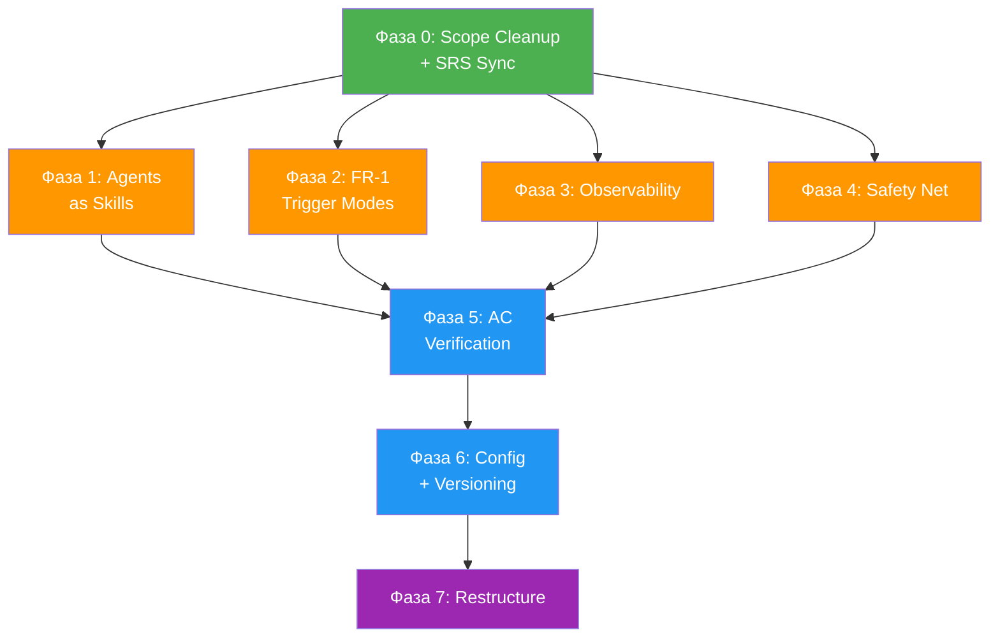

# Roadmap: FR Implementation Plan

## Goal

Порядок реализации оставшихся FR. Учёт зависимостей, рост качества,
стратегическая ценность. Привести SRS/SDS в актуальное состояние.

## Overview

### Current State

- **SRS AC status:** 14 `[x]` / 28 `[ ]` (реальный прогресс выше — SRS
  отстаёт от кода)
- **Полностью реализовано (с evidence):** FR-10 (Agent Log Storage)
- **Реализовано, SRS не обновлён:**
  - FR-18 (Verbose Output) — merged PR #7, все 8 AC выполнены
  - FR-8 (Continuation) — PR #8 open (agent/8), 6 AC закрыты.
    Остаётся 1 AC: deletion check
- **Работает де-факто, нет формальной верификации AC:**
  - FR-2 (PM), FR-3 (Tech Lead), FR-4 (Reviewer), FR-5 (Architect),
    FR-6 (SDS Update), FR-7 (Executor+QA), FR-9 (Presenter), FR-11 (Meta-Agent)
- **Не реализовано:**
  - FR-1 (Pipeline Trigger) — только `run:task` работает. `run:issue` и GH
    pipeline **убираются из scope** (deferred). Остаются: `run:text`, `run:file`
  - FR-17 (Directory Structure) — все 8 AC `[ ]`
  - FR-NEW (Agents as Skills) — новое требование
- **Частично:**
  - FR-12 (Runtime Infra) — devcontainer OK, gitleaks нет
  - FR-13, FR-14, FR-15, FR-16 — частично
- **Meta-agent known bugs:**
  - P-003: Нет логов loop body nodes — 3 occurrence
  - P-007: Config drift pipeline.yaml ↔ pipeline-task.yaml
  - P-008: sds-update after-hook пустой diff

### Scope Changes

1. **Убрать из SRS/SDS:**
   - FR-1: `run:issue <N>`, GitHub Issue trigger, re-run guard
   - FR-9: issue comment posting via `gh`
   - FR-11: issue comment posting
   - FR-12: GHA workflow
   - FR-14: `agent/<issue-number>` branch naming (для issue mode)
   - Все упоминания GH issue-based trigger
   - Оставить: `run:task`, `run:text`, `run:file`

2. **Новый FR — Agents as Skills:**
   - Каждый агент pipeline = Claude Code project skill
   - Структура: `./agents/<name>/SKILL.md` (основной файл)
   - Связь: `.claude/skills/<name>` → symlink на `../../agents/<name>/`
   - 9 агентов: pm, tech-lead, tech-lead-reviewer, architect, tech-lead-sds,
     executor, qa, presenter, meta-agent
   - Текущие `.sdlc/agents/*.md` → мигрируют в SKILL.md
   - Engine использует SKILL.md через symlink
   - Каждый скил вызывается standalone через `/agent-<name>`
   - Формат: frontmatter (name, description, disable-model-invocation) +
     markdown instructions

### Constraints

- Одна задача за раз (single pipeline execution)
- FR-17 (restructure) ломает все пути — последним
- SRS accuracy — фундамент для PM agent
- Каждая фаза оставляет систему рабочей

## Roadmap

### Фаза 0: Scope Cleanup + SRS Sync

**Цель:** SRS/SDS в актуальном состоянии. Deferred scope убран.

- Merge PR #8 (FR-8)
- Убрать из SRS/SDS: `run:issue`, GH issue trigger, issue comments, GHA,
  `agent/<N>` branching
- Обновить SRS маркеры: FR-8 (6 AC → `[x]`), FR-18 (8 AC → `[x]`)
- Удалить task files: fr-8.md, fr-10-agent-log-storage.md
- Добавить новый FR (Agents as Skills) в SRS

**Зависимости:** нет
**Результат:** SRS точен, ~14 → ~28 `[x]`

---

### Фаза 1: Agents as Skills (FR-NEW)

**Цель:** Каждый агент = локальный скил, standalone + pipeline.

- Создать `./agents/` с 9 подпапками, каждая с SKILL.md
- Мигрировать `.sdlc/agents/*.md` → SKILL.md с frontmatter
- Symlinks: `.claude/skills/agent-pm` → `../../agents/pm/` и т.д.
- Engine: обновить `prompt:` пути в pipeline.yaml
- Удалить `.sdlc/agents/` после миграции
- Тесты: `deno task check` + pipeline dry-run

**Зависимости:** Фаза 0
**Результат:** `/agent-pm`, `/agent-qa` работают standalone. Pipeline
использует те же файлы.
**Качество:** Двойное использование: pipeline + интерактивно

---

### Фаза 2: FR-1 Trigger Modes (без issue)

**Цель:** Полный набор trigger modes (кроме issue).

- `deno task run:text "..."` — inline text
- `deno task run:file <path>` — файл (эволюция `run:task`)
- Единые engine flags для всех subcommands

**Зависимости:** Фаза 0
**Результат:** Гибкий CLI

---

### Фаза 3: Observability Gaps

**Цель:** Логи для всех nodes, корректные артефакты.

- P-003: Логи loop body nodes (executor, qa)
- P-008: sds-update after-hook (`git diff HEAD~1 --`)
- P-007: Верификация fix config drift

**Зависимости:** FR-10 (done)
**Результат:** Meta-agent анализирует 100% nodes

---

### Фаза 4: FR-12 + FR-16 + FR-8 (Safety Net)

**Цель:** Полноценные проверки безопасности.

- Gitleaks в devcontainer (Dockerfile)
- FR-8: deletion check в safetyCheckDiff
- FR-16: no hardcoded secrets
- Shellcheck для legacy scripts

**Зависимости:** FR-8 (done)
**Результат:** Security: regex → production-grade

---

### Фаза 5: AC Verification (FR-2–7, FR-9, FR-11)

**Цель:** Все agent stages верифицированы с evidence в SRS.

- Pipeline на 3+ реальных задачах
- Каждый AC → evidence
- FR-13, FR-14 — попутно

**Зависимости:** Фазы 1-4
**Результат:** ~42/42 AC с evidence

---

### Фаза 6: FR-15 + FR-13 (Config + Versioning)

**Цель:** Конфигурируемость, предсказуемый re-run.

- FR-15: env vars → engine, fallback to defaults
- FR-13: overwrite on re-run, iteration suffix

**Зависимости:** Фаза 5

---

### Фаза 7: FR-17 — Directory Restructure

**Цель:** Стандартная IDE-friendly структура.

- `.sdlc/engine/` → `src/engine/`
- `agents/` уже на месте (Фаза 1)
- `.sdlc/pipeline.yaml` → root/config
- `.sdlc/runs/` → `runs/` (gitignored)
- `.sdlc/scripts/` → `scripts/`
- deno.json, imports, тесты, SDS

**Зависимости:** Все предыдущие (высокий риск)

---

## Зависимости

## Параллелизм

Фазы 1, 2, 3, 4 — **параллельно** после Фазы 0:
- Skills — `./agents/`, `.claude/skills/`, engine paths
- Triggers — engine/cli.ts
- Observability — engine/loop.ts, engine.ts, git.ts
- Safety — Dockerfile, engine/git.ts

Фазы 5, 6, 7 — **последовательно**.

## Оценка

- Фаза 0: ручная (~1h)
- Фаза 1: ~1 pipeline run
- Фаза 2: ~1 pipeline run
- Фаза 3: ~1 pipeline run
- Фаза 4: ~1 pipeline run
- Фаза 5: ~3 pipeline runs
- Фаза 6: ~1 pipeline run
- Фаза 7: ~1 pipeline run
- **Итого: ~10-12 pipeline runs**
